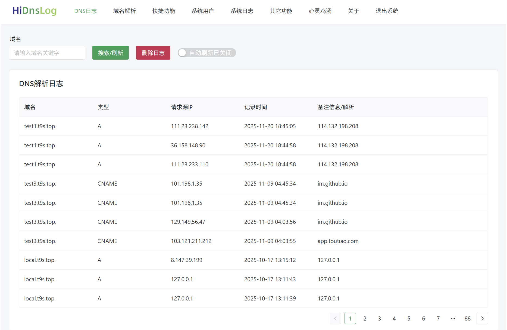

# HiDnsLog-Release
Release HiDnsLog

```

一个可查询和管理DNS解析记录的工具，支持DNSlog 私有化部署，即使用自己的域名。

支持完整的DNS Server 功能，支持自动从其它DNS Server返回解析记录。

目前支持 A、AAAA、CNAME、MX、TXT 记录，白帽子师傅完全够用。

支持域名解析自动二次绑定（绕过一些检测）。

支持TTL 设置为 0，这是白帽必备功能，且几乎所有域名服务商都不支持，所以要用自己的。

支持 A记录、CNAME记录的重绑定，并且支持指定重绑定的解析顺序，一切尽在你的掌控中，无需大量随机碰撞。

*支持SSRF跳转漏洞测试，支持Burp Collaborator。


```


# HiDnsLog-安装和使用

https://www.bilibili.com/video/BV1UPSgBPERq


下面先简单说一下安装步骤：
```
运行方式1：直接运行服务
./hidnslog_linux_amd64


运行方式2：安装成服务
./hidnslog_linux_amd64 install

启动服务
service hidns start

停止服务
service hidns stop

查看服务状态
service hidns status

如果后期需要删除服务，可执行下面命令：
./hidnslog_linux_amd64 uninstall


启动成功后，用浏览器直接访问web控制台：
http://你的IP:8053
初始用户名：hidns
初始密码：123456

进入系统后请第一时间修改密码，切记。
```

然后把你自己的域名解析到服务商那边改到你自己的部署的服务器IP就可以了，需要两个NS，防火墙要开 UDP 协议的 53端口。

具体使用细节也可以群里面直接问我。

来张图：



# 更新记录

```
v1.0.10

增加二级范域名解析，方便白帽子更好地测试。

比如我在 HiDnsLog 上添加了 test2.t9s.top 的解析

此时我请求 test2.t9s.top 子域名是有解析的，但是如果我要再做别的测试，可能导致缓存或者需要再新增二级域名，v1.0.10 版本可以直接在子域名前面再加一些随机字符来访问，就避免了担心缓存问题，也不用再额外去新增，可直接在前面加随机字符，例如：

dR71.test2.t9s.top
uCj7.test2.t9s.top
8amI.test2.t9s.top
prVh.test2.t9s.top
...

可自己随意加，直接访问即可，也可以用来外带一些获取的值。

```


