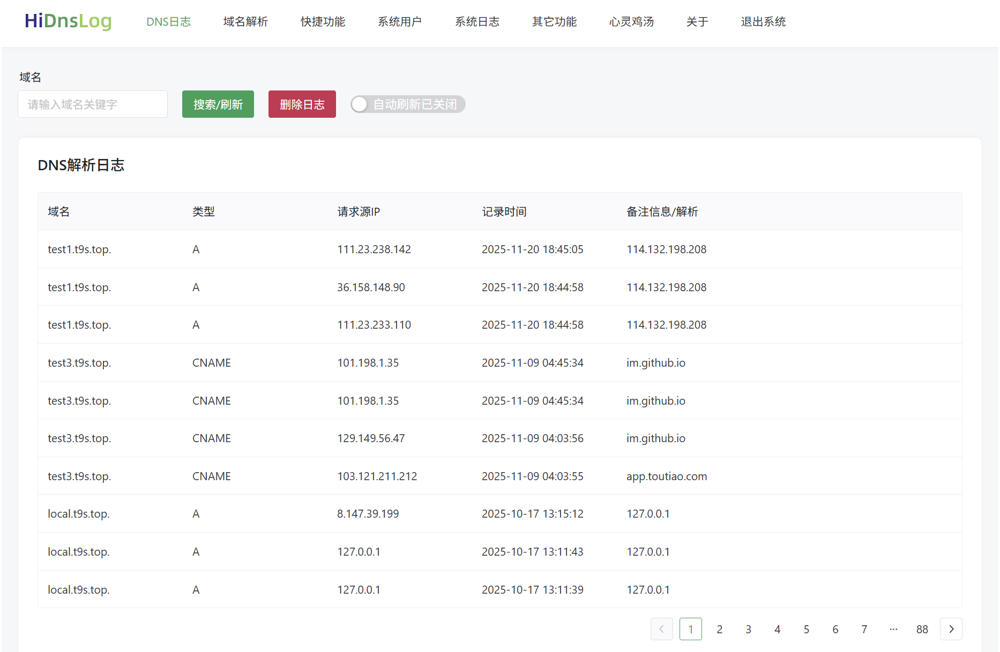
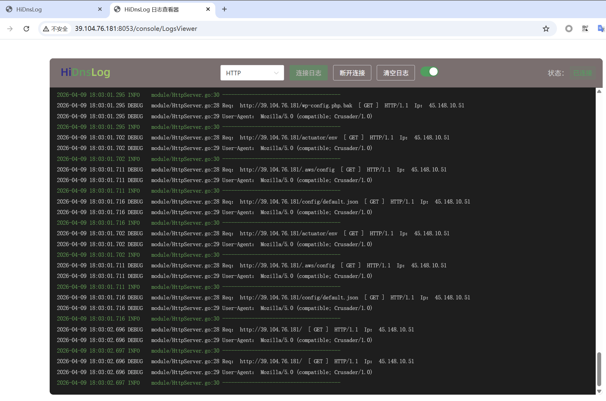

# HiDnsLog-Release
Release HiDnsLog

```

一个可查询和管理DNS解析记录的工具，支持DNSlog 私有化部署，即使用自己的域名。

支持完整的DNS Server 功能，支持自动从其它DNS Server返回解析记录。

目前支持 A、AAAA、CNAME、MX、TXT 记录，白帽子师傅完全够用。

支持域名解析自动二次绑定（绕过一些检测）。

支持TTL 设置为 0，这是白帽必备功能，且几乎所有域名服务商都不支持，所以要用自己的。

支持 A记录、CNAME记录的重绑定，并且支持指定重绑定的解析顺序，一切尽在你的掌控中，无需大量随机碰撞。

支持二级域名的随机泛域名，更好地避免强制缓存。

*支持SSRF跳转绕过，支持Burp Collaborator。


```


# HiDnsLog-安装和使用

视频教程
https://www.bilibili.com/video/BV1UPSgBPERq


如果不喜欢看视频，下面先简单说一下安装步骤：
```
运行方式1：直接运行服务
./hidnslog_linux_amd64


运行方式2：安装成服务
./hidnslog_linux_amd64 install

启动服务
service hidns start

停止服务
service hidns stop

查看服务状态
service hidns status

如果后期需要删除服务，可执行下面命令：
./hidnslog_linux_amd64 uninstall


启动成功后，用浏览器直接访问web控制台：
http://你的IP:8053
初始用户名：hidns
初始密码：123456

进入系统后请第一时间修改密码，切记。
```

然后把你自己的域名解析到服务商那边改到你自己的部署的服务器IP就可以了，需要两个NS，防火墙要开 UDP 协议的 53端口。

具体使用细节也可以群里面直接问我。

来张图：



# 更新记录

```
v1.0.10

增加二级泛域名解析，方便白帽子更好地测试。

比如我在 HiDnsLog 上添加了 test2.t9s.top 的解析

此时我请求 test2.t9s.top 子域名是有解析的，但是如果地方有强制缓存就会影响测试。

该版本可以直接在子域名前面再加一些随机字符来访问，就避免了机房强制缓存的问题，可直接在前面加随机字符，例如：

dR71.test2.t9s.top
uCj7.test2.t9s.top
8amI.test2.t9s.top
prVh.test2.t9s.top
...

可自己随意加，直接访问即可，也可以用来外带一些获取的值。


v1.2.1

1、增加在线实时看web请求日志，包括请求 IP 和 UA（User-Agent）头

2、增加302跳转配置

3、HttpModule 支持建多个web站点并绑定域名头，也支持默认站点，目前支持三种类型 static、text、redirect，如果需要支持更多的类型，可以关注我另外一个项目 HiWeb

4、支持配置 HTTP 和 HTTPS 站点，支持多个主机头，支持配置SSL证书

注意，部署在国内的主机，如果需要使用域名进行测试请求头，需要确定是否做好ICP备案，否则请求会被机房拦截。


```

HiDnsLog 目前一共有两个配置文件，分别是：

config.json 主程序相关的配置，包括控制台端口、服务名、dns 等服务参数

http.json 当需要开启 HTTP Web服务模块时的配置文件，由 HttpModule 开关控制该模块是否启用


# 下面给出 http.json 配置文件的范例

```

{
  "HttpModule": "on",
  "Description": "HttpModule 为 on 时本配置生效，为 off 时 http 模块不运行",
  "WebServers": [
    {
      "ServerType": "HTTP",
      "ListenAddr": ":80",
      "RealServers": [
        {
          "HostName": "<default>",
          "SType": "static",
          "Static": {
            "WebRoot": "./html",
            "DefaultPage": "index.html",
            "ListDir": false
          }
        },
        {
          "HostName": "text.t6s.top",
          "SType": "text",
          "Text": {
            "TextContent": "OK",
            "ContentType": "text/plain",
            "StatusCode": 200
          }
        },
        {
          "HostName": "ssrf.t6s.top",
          "SType": "redirect",
          "Redirect": {
            "TargetUrl": "https://ssrf.xxx.com",
            "RedirectCode": 302,
            "PreservePath": true,
            "PreserveQuery": true
          }
        }
      ]
    },
    {
      "ServerType": "HTTPS",
      "ListenAddr": ":443",
      "RealServers": [
        {
          "HostName": "t.t6s.top",
          "CertFile": "./sslcert/t.t6s.top.crt",
          "KeyFile": "./sslcert/t.t6s.top.key",
          "SType": "text",
          "Text": {
            "TextContent": "OK",
            "ContentType": "text/plain",
            "StatusCode": 200
          }
        },
        {
          "HostName": "test1.t6s.top",
          "CertFile": "./sslcert/test1.t6s.top.crt",
          "KeyFile": "./sslcert/test1.t6s.top.key",
          "SType": "redirect",
          "Redirect": {
            "TargetUrl": "https://ssrf.xxx.com",
            "RedirectCode": 302,
            "PreservePath": true,
            "PreserveQuery": true
          }
        }
      ]
    }
  ]
}

```


HttpModule 开启时，如果您配置了 HTTPS 站点，则需要对应的证书文件，默认建议存放在 sslcert 目录下。

主机头配置 <default> 为特殊主机头，表示所有域名都匹配不成功时，默认该站点配置。

HTTPS 的 <default> 站点，默认加载下面路径的证书文件：

./sslcert/default.crt

./sslcert/default.key

注意：HiDnsLog 并不会把 sslcert 目录对外访问，也无法被外部下载，只有服务程序可以读取到。


在线实时查看 logs 日志 功能图：



目前有些功能在慢慢完善，也有的功能会调整，等后期再统一弄个详细的使用文档，有个别地方如果有疑问的话，可以给我微信发消息咨询，会在线解答。


